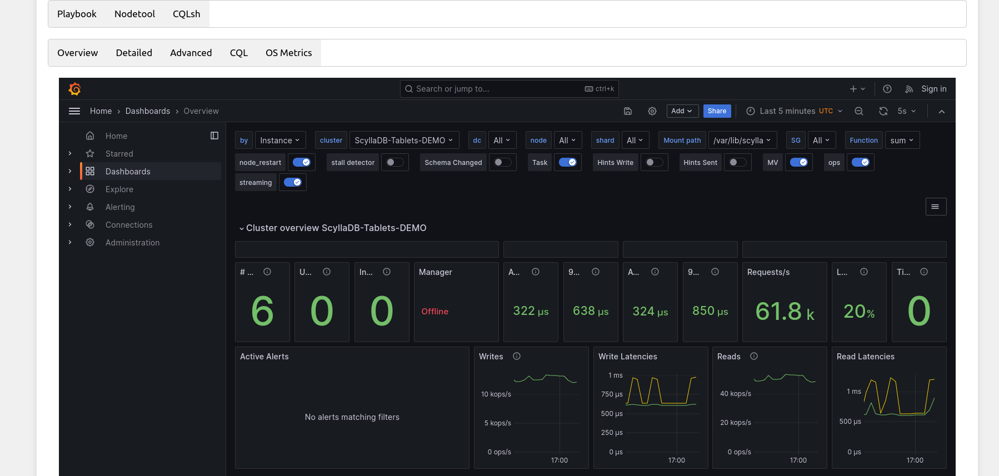

# ScyllaDB Tablets DEMO
This project walks you through the following scenario:
1. Starting off with 3 ScyllaDB nodes
1. Spike in the number of requests
1. Add 3 additional ScyllaDB nodes to handle requests
1. Request volume goes down
1. Remove 3 nodes

## Requirements
* AWS account
* [Terraform](https://developer.hashicorp.com/terraform/tutorials/aws-get-started/install-cli)
* [Ansible](https://docs.ansible.com/ansible/latest/installation_guide/intro_installation.html)

## Usage
1. Clone the repository
    ```
    git clone https://github.com/zseta/tablets-scaling.git
    ```
1. Create EC2 instances in AWS (takes 4+ minutes)
    ```bash
    terraform init
    terraform plan
    terraform apply
    ```
1. Open ScyllaDB Monitoring
    
    One of the Terraform outputs is the link to Monitoring, similar to this:
    ```
    Outputs:

    monitoring_url = "http://<IP-ADDRESS>:3000"
    [...]
    ```
    There should be 1 active node and 5 unreachable nodes seen on the dashboard.
1. CD into the ansible folder to run playbooks
    ```
    cd ansible
    ```
1. Start up a 3 node cluster
    ```bash
    ansible-playbook 1_original_cluster.yml
    ```
1. Create schema and restore snapshot (takes 5+ minutes)
    ```
    ansible-playbook 2_restore_snapshot.yml
    ```
1. Start cql-stress
    ```
    ansible-playbook 3_stress.yml
    ```
1. Scale out (start up 3 more nodes)
    ```
    ansible-playbook 4_scale_out.yml
    ```
1. Stop cql-stress
    ```
    ansible-playbook 5_stop_stress.yml
    ```
1. Scale in (stop 3 nodes)
    ```
    ansible-playbook ansible/6_scale_in.yml
    ```
1. Stop demo and remove AWS infrastructure
    ```
    cd ..
    terraform destroy
    ```

## DEMO UI
You can also run the DEMO with a user interface. To access the UI, run Terraform as usual then open `index.html` (the link to this file is also an output of TF).


